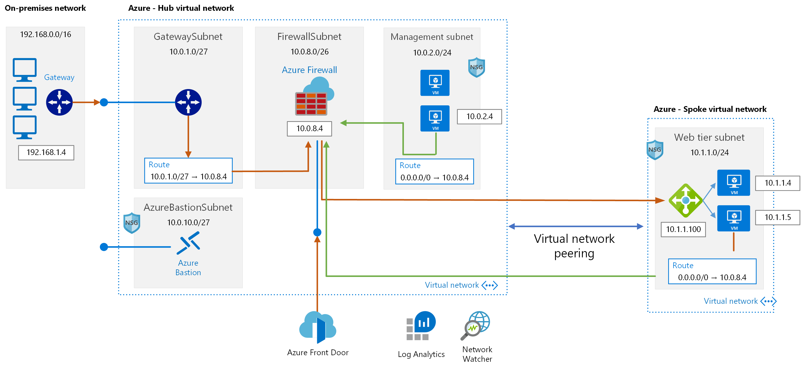

# Azure Networking Terraform lab templates

## Credits:
This lab infrasctucture was created and inspired based on Adilson Coutrim Azure Basic Networking Lab:
https://github.com/adicout/lab/tree/master/Network/basic-networking
For detailed instructions and information, visit his repo!

## Overview

 In this hands-on lab, you will setup a virtual networks in a hub-and-spoke design. You will also learn how to secure virtual networks by implementing Azure Firewall, network security groups and application security groups, as well as configure route tables on the subnets in your virtual network. Additionally, you will set up access to the virtual network via a jump box and provision a site-to-site VPN connection from another virtual network, providing emulation of hybrid connectivity from an on-premises environment.

At the end of this hands-on lab, you will be better able to configure Azure networking components and you will be learning:

- How to bypass system routing to accomplish custom routing scenarios.

- How to setup and configure a virtual network and subnets on Azure

- How to capitalize on load balancers to distribute load and ensure service availability.

- How to implement Azure Firewall to control hybrid and cross-virtual network traffic flow based on policies.

- How to implement a combination of Network Security Groups (NSGs)  to control traffic flow within virtual networks.

- How to monitor network traffic for proper route configuration and troubleshooting.

- How to create all required infrastructure and configuration using Terraform

## Network Architecture

## Requirements

- Valid the Azure subscription account. If you don’t have one, you can create your free azure account (https://azure.microsoft.com/en-us/free/).

## How to use the templates

1. Download terraform files:
   * main.tf
   * variables.tf
   * terraform.tfvars
   
   > In the Module-Version folder you will find the same Terraform templated with files divided by Azure Modules to make easier to you    find what resource you need to create and how to do it.
   
2. Edit main.tf file and change the following configuration:
   * Locate Provider AzureRM and change to match your subscription information:
     * subscription_id = Your Azure Subscription ID
     * client_id       = Your Azure Service Principal App ID
     * client_secret   = Your Azure Service Principal Client Secret
     * tenant_id       = Your Azure Tenant ID
    * If you do not have a service principal, please follow this guide to create one:
    https://www.terraform.io/docs/providers/azurerm/guides/service_principal_client_secret.html
    
3. Edit terraform.tfvars file and change the following variable values:
   * location = Azure Region where you want to deploy
   * prefix = Prefix string that will be used for resource creation
   * adminname = Windows VM Local Admin Name
   * adminpwd = Windows VM Local Admin Password (must be complex and 12 char long)
   * vmsize = "Standard_D2s_v3" (Azure VM Size you want to use, change if needed)
   * frontdoorname = Azure Front Door Host Name. It will be name that you will use to access Front Door later and must be unique.  
     Example: myfrontdoor01.azurefd.net

> You can use Azure Cloud Shell to execute your terraform template: https://shell.azure.com 

4. Initiliaze your terraform environment:
   
   > terraform init
   
5. Plan and review your terraform deployment:
   
   > terraform plan
   
6. Apply your terraform template (It takes at least 45 minutes to be complete):

   > terraform apply

## Test your lab deployment

* Follow Exercise 11 from Basic Networking Guide: https://github.com/adicout/lab/tree/master/Network/basic-networking
* Get your Front Door Hostname (Example: myfrontdoor.azurefd.net) and access it using your favorite Internet Browser:
  * You must use HTTP because website only respond to HTTP (TCP 80) port: http://myfrontdoor.azurefd.net
  * You should be able to access the Web Application on the Spoke VNET.
  * You access is flowing thru Azure Front Door to Azure Firewall, at Azure Firewall there's a NAT Rule that send communication to the internal Load Balancer that publish you web site via Private IP.

## Clean All Resources after the lab

After you have successfully completed the Azure Networking Terraform lab , you will want to delete the Resource Groups. Run following terraform command:

   > terraform destroy

